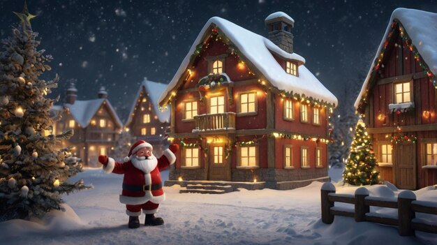

  

>Welcome to my Winter Wonderland website, where you can explore the beauty of winter in Finland!

## Top to see and do list in Finland
- Beautiful snowy landscapes
- Winter activities
- Festive decorations

>Head to Rovaniemi for a quintessential winter wonderland experience in Finnish Lapland. Rovaniemi has everything you could wish for: an ice hotel, Santa Claus Village, and snow-covered landscapes. This makes it a great spot for dog sledding, snowmobiling, skiing, ice fishing, and other fun winter activities.
 

>Santa Claus has made Lapland in Northern Finland his home for centuries, and the Arctic Circle is close to his heart because many Christmas secrets are rooted in this magical place. Santa Claus Village is a family destination with plenty to see and do for all ages.

 

> Finns' physical activity includes swimming, hiking, camping, hunting, sailing, golf, skiing, and ice hockey. For them, taking a break from the modern world is a great way to reflect and clear one's thoughts. 

  